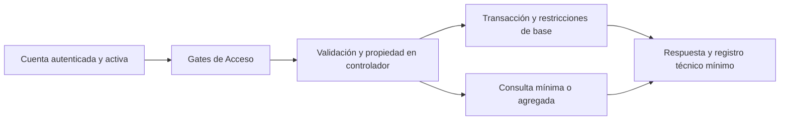

# ALPHA FITNESS — AUDITORÍA INTEGRAL Y HARDENING

Fecha: 7 de octubre de 2026. Alcance: aplicación Laravel existente, controles del servidor, integridad financiera, privacidad, regresión y documentación. Este informe describe el estado del árbol de trabajo y distingue las comprobaciones ejecutadas de las pendientes de entorno. No contiene credenciales ni datos de clientes.

## 1. Veredicto inicial

El proyecto ya contenía funciones válidas, autorización central, protección de imágenes, configuración de sesiones y pruebas. También incorporaba cambios anteriores sin confirmar: 33 archivos rastreados modificados y 22 entradas no rastreadas al comenzar la intervención. Esas entradas podían representar directorios completos; no equivalen a 22 archivos. No era apropiado reiniciar la arquitectura ni atribuir todo el diff a esta auditoría.

La revisión encontró defectos concretos de aislamiento entre proveedores de autenticación, identificación del entrenador por nombre, integridad histórica y operaciones financieras repetidas. La existencia de pantallas y pruebas no demostraba por sí sola preparación para producción.

El disco C: llegó a quedarse sin espacio, interrumpiendo parte de la verificación y una escritura del controlador de ventas. Tras autorización expresa se liberaron aproximadamente 1,3 GB de cachés regenerables de npm y Composer. Se reconstruyó el controlador afectado y se volvieron a ejecutar pruebas del dominio. Se conservaron la configuración real, los logs y los datos.

## 2. Problemas críticos encontrados

- Tokens de recuperación sin aislamiento suficiente entre empleados y clientes: `config/auth.php`, `app/Http/Controllers/Auth/EstablecerPasswordController.php`.
- Permiso de seguimiento del entrenador vinculado a un nombre no único: `app/Http/Controllers/ProgresoController.php`, `app/Http/Controllers/RutinaController.php`, `app/Models/Rutina.php`.
- Historial de ventas expuesto a borrado en cascada: claves foráneas de `ventas.user_id` y `detalle_ventas.producto_id`.
- Reintentos de venta y finalización de entrenamiento capaces de duplicar operaciones: `app/Http/Controllers/VentaController.php`, `app/Http/Controllers/RutinaController.php`.
- Extensión de una pausa capaz de invadir una renovación registrada: `app/Http/Controllers/MembresiaController.php`.
- Texto controlable interpretado como fórmula en exportaciones: `app/Http/Controllers/AsistenciaController.php`, `app/Services/ReporteExcelService.php`.
- Versiones afectadas por avisos de seguridad en dependencias: `composer.lock`, `package-lock.json`.

## 3. Seguridad

La autorización mantiene `App\Support\Acceso` como matriz para Gates, rutas y navegación. Se corrigió la divergencia entre asistencia y el Gate que permitía acceso al administrador; las acciones se comprueban en el servidor. Los roles desconocidos y las cuentas inactivas no obtienen permisos por defecto.

La recuperación distingue los brokers `users` y `clientes`, sus tablas de tokens y el campo de correo de cada proveedor. No permite utilizar un enlace de un proveedor para cambiar la contraseña del otro. La respuesta al solicitar recuperación es genérica, restringe cuentas inactivas y limita intentos; errores del transporte registran la clase de excepción sin incorporar credenciales ni enlaces privados.

Las rutas sensibles conservan CSRF y validación del servidor. Se añadieron límites compartidos de exportación, 10 solicitudes por minuto y cuenta, y operaciones financieras, 60 por minuto y cuenta. Login, registro y recuperación mantienen límites de 5 por minuto; OAuth, 20 por minuto. La identidad del límite incluye el tipo de cuenta para evitar colisiones entre IDs de empleados y clientes.

Se aplica `Cache-Control: private, no-store` a formularios de acceso y recuperación; las páginas que contienen enlaces de recuperación usan `Referrer-Policy: no-referrer`. Se conservaron los headers de protección existentes. La CSP sigue permitiendo código inline; esta limitación figura entre los riesgos restantes.

Las ventas validan UUID, método de pago, cliente activo, máximo de líneas y cantidad agregada por producto. Los productos se bloquean en orden estable dentro de una transacción, los precios proceden de la base y un UUID de otra cuenta no revela su venta. Las sesiones normalizan el UUID y comprueban propietario y contenido antes de aceptar un reintento.

## 4. Privacidad

El historial de asistencia del cliente se consulta por su identidad autenticada. El entrenador consulta progreso únicamente cuando existe una asignación por su ID; conocer un cliente o repetir el nombre de otro entrenador no concede acceso. El administrador conserva la consulta autorizada de progreso de clientes.

Las exportaciones de asistencia dejaron de incluir el correo del cliente y ya no seleccionan ese dato para componer las filas. Los reportes financieros trabajan con agregados, sin listas de clientes ni sus credenciales. `Cliente` oculta `google_id` además de contraseña y token de recuerdo al serializarse.

Los avatares siguen siendo imágenes públicas. La política lo explica y advierte que no deben contener documentos ni contenido privado. No se presenta esa publicación como almacenamiento privado.

## 5. Cifrado y contraseñas

Las contraseñas se protegen con el mecanismo de hash de Laravel y se verifican con sus servicios. Recuperación usa `Hash::make`, exige confirmación y fortaleza de contraseña, cambia el token de recuerdo y emite `PasswordReset`. No se implementó criptografía propia ni cifrado reversible de contraseñas.

Se conservan el cifrado de sesión configurable, cookies HttpOnly y SameSite=Lax, regeneración del acceso y cierre de sesión existente. La configuración diferencia HTTP local de las cookies Secure de producción. `APP_KEY` debe conservarse y custodiarse; no se regeneró la clave real.

No se cifró toda la base por columnas: no se justificó una modificación que rompiera búsquedas e índices del dominio actual. Los datos de progreso requieren control de acceso, protección de la base, copias y HTTPS. El almacenamiento de datos bancarios completos o tokens de acceso OAuth no forma parte del flujo actual.

## 6. Roles y permisos

Matriz comprobada en `Acceso`, Gates, rutas y comprobaciones de propiedad de los controladores. «Propio» se refiere a la identidad autenticada, no a un ID recibido sin autorización. La matriz no concede privilegios solo por mostrar un botón.

| Acción o módulo | Administrador | Secretaria | Entrenador | Cliente |
| --- | --- | --- | --- | --- |
| Administración y bloqueo de cuentas | Sí | No | No | No |
| Crear, invitar y editar personal; asignar roles permitidos | Sí; Secretaria/Entrenador | No | No | No |
| Crear, editar y desactivar planes | Sí | No | No | No |
| Inventario y mantenimiento de productos | Sí | Sí | No | No |
| Ventas y comprobantes | Sí | Sí | No | No |
| Asistencia general, entradas/salidas y exportación | Sí | Sí | No | No |
| Asistencia personal del cliente | No por ruta de cliente | No por ruta de cliente | No por ruta de cliente | Propia |
| Consulta de membresías | Sí | Sí | No | Propias |
| Activar/cancelar membresías y resolver solicitudes de pausa por Gate operaciones | No | Sí | No | No |
| Solicitar membresía | No | No | No | Propia |
| Cancelar solicitud de membresía pendiente | No | Sí | No | Propia |
| Solicitar pausa o reanudar | Sí, con validaciones | Sí, con validaciones | No | Propia, con validaciones |
| Analítica financiera y PDF/Excel agregados | Sí | No | No | No |
| Construir, editar, imprimir y entrenar rutinas | Propias | Propias | Propias | Propias |
| Asignar una rutina a un cliente | Rutina propia | No | Rutina propia | No |
| Consultar progreso de un cliente | Sí | No | Cliente asignado por su ID | Solo propio |
| Registrar/eliminar marcas deportivas de cliente | No | No | No | Propias |
| Historial de sesiones | Propio | Propio | Propio | Propio |
| Catálogo de ejercicios y calificación | Sí | Sí | Sí | Sí |
| Crear/editar/desactivar ejercicios | Sí | No | No | No |
| Directorio de entrenadores y catálogo de productos | Sí | Sí | Sí | Sí |
| Perfil, contraseña, avatar y apariencia | Propios | Propios | Propios | Propios |

El administrador no recibe automáticamente el Gate `operaciones` reservado a Secretaria. Puede solicitar una pausa de aplicación automática o reanudar por sus rutas autorizadas, pero las rutas para resolver una solicitud pendiente tienen ese Gate y permanecen cerradas para él. Algunas comprobaciones internas de aprobación contemplan Administrador: no deben interpretarse como permiso efectivo cuando la ruta lo deniega. Cambiar esa regla de negocio requiere una decisión expresa.

## 7. Base de datos

Se prepararon migraciones incrementales para aislar tokens de clientes, preservar ventas y detalles, identificar al asignador de rutinas con una clave foránea y evitar duplicados por UUID. No se editaron migraciones antiguas aplicadas para simular una evolución del esquema.

`restrictOnDelete` evita que borrar un empleado destruya sus ventas o borrar un producto destruya detalles financieros. Se mantiene la desactivación como operación normal. No se agregaron `SoftDeletes` indiscriminadamente.

Las ventas usan `DECIMAL` para persistencia y centavos enteros para sumar y multiplicar. Pausas y activaciones comparten bloqueo del cliente; se rechaza extender sobre otra membresía no cancelada y se preservan ambos períodos. Las pruebas verifican rechazo y rollback, además de extensiones válidas.

Las migraciones se comprobaron mediante bases de pruebas. No se aplicaron a la base real: el despliegue debe respaldar y ejecutar las pendientes, verificar el motor objetivo y comprobar recuperación. La migración de tokens invalida enlaces anteriores ambiguos; los titulares deben pedir enlaces nuevos. No hay backfill automático de entrenadores a partir de nombres: las asignaciones históricas requieren verificar y reasignar mediante el flujo autorizado.

## 8. Código eliminado

Se retiró el correo del cliente del CSV de asistencia y de la selección necesaria para ese archivo. Se sustituyeron las comprobaciones dispersas de rol en asistencia por el Gate existente. Se retiró el uso del nombre del entrenador como prueba de autorización y la exposición de `google_id` en serialización.

Se eliminaron mensajes de excepción del transporte de correo en los logs de ventas, sustituidos por ID técnico y clase de error. También se retiraron fuentes de duplicación y operaciones financieras con cálculos directos de coma flotante en las rutas corregidas.

No se eliminaron módulos, assets ni dependencias por ausencia aparente de una referencia. No se ejecutó limpieza masiva de logs, datos o cambios previos. La limpieza del disco se limitó a cachés regenerables autorizadas.

## 9. Código conservado

Se conservó Laravel y la arquitectura Blade/Vite, el sistema `Acceso`/Gates, el servicio `ImagenSegura`, los mecanismos de sesión y hash, CSRF, `RegistroAsistencia`, el esquema de membresías y la vinculación explícita de Google. Estos componentes se mantuvieron como base y se corrigieron sus consumidores cuando era necesario.

También se preservaron las funciones de clientes, personal, productos, ventas, membresías, asistencia, rutinas, ejercicios, progreso, Entrenar Ahora, historial, configuración, apariencia y reportes. Las pruebas de regresión aportan evidencia de las rutas cubiertas; no equivalen a una revisión manual exhaustiva de cada pantalla.

## 10. Interfaz

El acceso enlaza recuperación y privacidad. Registro explica el uso de datos y ofrece consultar el aviso antes de crear la cuenta. Se añadieron o integraron vistas funcionales para asistencia propia, progreso del entrenador, historial y analítica existentes en el árbol de trabajo.

La finalización de entrenamiento y el formulario de ventas envían identificadores de reintento. Se corrigieron estados del entrenamiento y conservación de datos temporales cuando falla una petición. Los controles, navegación y permisos visibles se alinearon con los Gates del servidor.

Se preservó el estilo de Alpha Fitness. Tras recuperar el navegador se comprobaron los anchos 1920, 1366, 1024, 768 y 390 px en dashboard, configuración, entrenamientos, ejercicios, membresías, asistencia, entrenadores, productos, ventas, analítica y cuentas del administrador. La revisión encontró un desbordamiento de 10 px en la cabecera de Entrenamientos a 768 px. Se corrigió apilando la cabecera y el seguimiento de clientes hasta el breakpoint de escritorio; la reprueba pasó en los cinco anchos.

También se verificaron constructor, Entrenar Ahora, historial, dashboard/membresías/asistencia/progreso del cliente, módulos operativos de Secretaria, dashboard/rutinas/progreso asignado del Entrenador y privacidad pública. Las 78 mediciones de la sesión final guardadas en `output/hardening/responsive-final.json` no detectaron desbordamiento de página; este archivo no incluye las mediciones de la sesión anterior. Son comprobaciones de geometría y observaciones de pantallas, no una certificación exhaustiva de accesibilidad.

En una base SQLite desechable se creó una rutina, se añadió un ejercicio, se completaron tres series y se verificó la sesión persistida en el historial. Se asignó otra rutina desde el entrenador y se abrió el progreso del cliente autorizado. El modal de ventas cerró con Escape y devolvió el foco al botón de apertura. Evidencia visual: `output/hardening/entrenamientos-768-final.png` y `output/hardening/entrenamiento-registrado-final.png`. No se modificaron datos reales con el navegador.

## 11. Política de privacidad

Existe `/privacidad`, accesible públicamente y desde login/registro y el layout. Describe cuenta, Google, membresías, asistencia, progreso, pagos, almacenamiento, acceso por función, cookies funcionales, conservación y solicitudes.

El responsable y el correo de privacidad se configuran mediante `PRIVACY_RESPONSIBLE_NAME` y `PRIVACY_CONTACT_EMAIL`. Si faltan, la página lo declara expresamente. No se inventaron razón social, contactos ni plazos legales. No se afirma cumplimiento de una ley específica.

No se añadió un registro de consentimiento legal ficticio ni un banner publicitario. El registro tiene información visible y enlace al aviso; el responsable debe determinar qué base y evidencia de tratamiento corresponden a su operación antes del uso general. También debe fijar plazos de conservación y gestión de copias.

## 12. Reportes y analítica

La analítica financiera utiliza pagos y ventas reales, cifras agregadas y filtros validados con fechas estrictas y un máximo de 90 días. Se corrigieron límites de períodos, incluido el mes anterior calculado a fin de marzo, y consistencia de importes entre KPIs y serie diaria.

Pantalla, PDF y Excel reciben el mismo conjunto agregado. Solo Administrador tiene el Gate de analítica. Las exportaciones registran el evento técnico sin incluir listados privados de clientes. Los textos de XLSX se escriben explícitamente como texto y los importes como números para evitar ejecución de fórmulas.

Las pruebas generan y vuelven a leer un XLSX real, comprueban las cinco hojas, tipos de celdas, ausencia de fórmulas y ausencia de datos privados adicionales. El PDF conserva su generación y pruebas existentes. El CSV operativo de asistencia conserva nombres necesarios para su propósito, elimina correos y neutraliza prefijos de fórmulas; no se confunde con un reporte financiero anónimo.

## 13. Rendimiento

La exportación de asistencia utiliza lotes de 500 con relaciones precargadas, en lugar de materializar todo el historial. Historiales de cliente y progreso mantienen paginación. La analítica limita el período y usa agregaciones; no necesita cargar perfiles individuales para calcular totales.

Se mantuvieron índices y consultas delimitadas y se añadió un índice para asignador/propietario de rutinas. No se incorporó Redis ni nueva infraestructura. No se ejecutaron pruebas de carga ni un benchmark de producción; estas mejoras se fundamentan en límites de consulta y pruebas funcionales, no en un porcentaje de aceleración inventado.

## 14. Dependencias

Se aplicaron actualizaciones puntuales analizadas, sin cambiar Laravel ni actualizar masivamente la pila.

| Ecosistema | Dependencia | Versión final | Acción |
| --- | --- | --- | --- |
| Composer | `laravel/framework` | 12.69.3 | Parche de la rama existente |
| Composer | `league/commonmark` | 2.10.3 | Parche dirigido |
| Composer | `league/flysystem` | 3.36.0 | Parche dirigido |
| Composer | `phpseclib/phpseclib` | 3.0.57 | Parche dirigido |
| npm | `shell-quote` | 1.11.0 | Resolución transitoria mediante override |
| npm | `source-map-js` | 1.2.2 | Resolución puntual del lockfile |

Eliminadas: ninguna dependencia funcional por una presunta falta de uso. Añadidas: ninguna infraestructura ni framework nuevo; se añadió la restricción de resolución indicada. Conservadas: Socialite, Dompdf, PhpSpreadsheet, Blade/Vite y servicios Laravel existentes. Los comodines de Dompdf y PhpSpreadsheet en Composer se sustituyeron por `^3.1.2` y `^5.10`, respectivamente, sin cambiar sus versiones instaladas; `composer validate` terminó sin avisos.

Auditorías finales comunicadas por integración: Composer sin avisos y npm sin vulnerabilidades reportadas. Estos resultados cubren la información publicada y el árbol resuelto en ese momento; no garantizan ausencia de defectos desconocidos.

Avisos oficiales consultados durante la corrección: [Laravel](https://github.com/advisories/GHSA-jh5r-qr3c-85q8), [CommonMark](https://github.com/advisories/GHSA-3q6v-r5mr-hxv8), [Flysystem](https://github.com/advisories/GHSA-cxf4-7mrp-vvpr), [phpseclib](https://github.com/advisories/GHSA-q97c-8qh3-fpc6), [shell-quote](https://github.com/advisories/GHSA-pqg4-j6r4-53mv) y [source-map-js](https://github.com/advisories/GHSA-68fv-2mgg-jv7q).

## 15. Archivos creados

«No rastreado» en Git no significa necesariamente creado por esta intervención: varios módulos ya existían al comenzar. La siguiente relación documenta su presencia y finalidad final, preservando esa distinción.

| Ruta o grupo | Finalidad |
| --- | --- |
| `config/privacy.php`, `resources/views/privacidad.blade.php` | Aviso público con responsable/contacto configurables |
| `app/Support/Dinero.php` | Conversión y operaciones de dinero en centavos |
| `database/migrations/2026_10_07_*.php` | Evolución incremental de tokens, historia, asignaciones y UUID |
| `tests/Feature/PasswordResetIsolationTest.php`, `HardeningRegressionTest.php` | Aislamiento y controles de seguridad/regresión |
| `tests/Feature/AsistenciaExportSeguridadTest.php`, `ReporteExcelSeguridadTest.php` | Privacidad y fórmulas en archivos reales |
| `tests/Feature/VentaIntegridadTest.php`, `SesionUuidNormalizacionTest.php`, `PausaRenovacionIntegridadTest.php` | Reintentos, rollback y límites de fechas |
| `tools/frontend_regression_check.cjs` | Verificación JS de flujos y estados |
| `docs/AUDITORIA_INTEGRAL.md` | Informe trazable de la intervención |
| Controlador/servicios/vistas de analítica, `ReporteFinancieroLog`, `SesionEntrenamiento`, asistencia propia e historial | Módulos presentes en trabajo anterior, integrados y verificados; no atribuidos íntegramente al hardening |

## 16. Archivos modificados

| Ruta o grupo | Motivo |
| --- | --- |
| `app/Http/Controllers/Auth/EstablecerPasswordController.php`, `app/Models/Cliente.php`, `config/auth.php` | Recuperación de ambos proveedores, tokens aislados y serialización mínima |
| `app/Support/Acceso.php`, `app/Providers/AppServiceProvider.php`, `routes/web.php` | Gates, permisos, rutas y límites de peticiones |
| `app/Http/Controllers/AsistenciaController.php` | Permiso coherente, asistencia propia, CSV mínimo y por lotes |
| `app/Http/Controllers/VentaController.php`, `app/Models/Venta.php` | Centavos, validación, atomicidad, reintento y log mínimo |
| `app/Http/Controllers/MembresiaController.php` | Orden de bloqueos y rechazo de pausa que invade otra vigencia |
| `app/Http/Controllers/RutinaController.php`, `app/Models/Rutina.php` | Asignador por ID, límites y sesiones sin duplicación |
| `app/Http/Controllers/ProgresoController.php` | Propiedad, asignación verificada y filtros |
| `app/Http/Middleware/EncabezadosSeguros.php` | No-cache y no-referrer en recuperación |
| `app/Services/AnaliticaFinancieraService.php`, `app/Services/ReporteExcelService.php` | Períodos, agregación consistente y texto literal en XLSX |
| `config/app.php`, `.env.example`, `.gitignore` | Zona configurable, contacto y protección de entornos/avatares |
| `composer.json`, `composer.lock`, `package.json`, `package-lock.json` | Parches dirigidos y resoluciones verificadas |
| Vistas de login, sidebar/layout, entrenamiento, ventas y módulos relacionados | Integración de funciones, privacidad, permisos y estados |
| `README.md`, pruebas afectadas y herramientas de verificación | Instalación/despliegue, evidencia y regresión |

Los archivos marcados como modificados incluyen trabajo anterior. El inventario exacto final y sus cantidades corresponden al apartado 22; esta tabla agrupa el propósito para facilitar revisión y no reemplaza el diff. La verificación global de Pint identificó 28 archivos con diferencias de formato heredadas; se corrigieron llaves, espaciado e imports sin cambiar sus reglas de negocio. La comprobación global posterior aprobó.

## 17. Migraciones nuevas

| Nombre | Finalidad y efecto |
| --- | --- |
| `2026_10_06_120000_create_sesiones_entrenamiento_table.php` | Persistencia del historial de entrenamiento del módulo previo |
| `2026_10_06_140000_create_reportes_financieros_logs_table.php` | Registro técnico de exportaciones del módulo previo |
| `2026_10_07_100000_isolate_client_password_reset_tokens.php` | Tabla de tokens exclusiva para clientes; invalida tokens antiguos ambiguos |
| `2026_10_07_100000_preserve_financial_history.php` | Restricción de borrados de vendedores y productos referenciados |
| `2026_10_07_110000_secure_routine_assignments_and_sessions.php` | Asignador por ID, índice y UUID único de sesión |
| `2026_10_07_120000_add_sale_retry_uuid.php` | UUID único y nullable para reintentos de ventas |

Los UUID nullable conservan compatibilidad de registros históricos. Las claves de reintento actuales deben mantenerse en el formulario hasta resolver la petición. Las migraciones no fueron ejecutadas contra los datos reales. El rollback de la separación de tokens no restaura enlaces invalidados; no debe prometerse esa recuperación.

## 18. Pruebas nuevas

- `PasswordResetIsolationTest`: correos coincidentes entre proveedores, rechazo cruzado, tokens propios y cuentas inactivas.
- `PasswordResetTest`, `CreateAdminCommandTest`, `GestionPersonalTest`, `AdminPermisosTest`: recuperación, administrador inicial y acceso permitido/prohibido de personal.
- `HardeningRegressionTest`: permisos, IDOR del entrenador, configuración de privacidad escapada, filtros inválidos, cabeceras, períodos y límites de exportación.
- `IntegridadFinancieraPrivacidadTest`, `VentaIntegridadTest`: preservación histórica, importes, cantidades repetidas, cliente inactivo, reintento sin doble stock, reintento ajeno, rollback completo y errores de correo sin datos privados.
- `PausaRenovacionIntegridadTest`: pausa automática y aprobación pendiente; rechazo de solapamiento, conservación de ambas membresías y pausa, extensión válida, renovación cancelada y períodos adyacentes.
- `SesionEntrenamientoTest`, `SesionUuidNormalizacionTest`: propietario, finalización persistida y normalización del UUID frente a reintentos.
- `ProgresoEntrenadorTest`, `AsistenciaClienteTest`: cliente asignado por ID y consultas de datos propios.
- `AsistenciaExportSeguridadTest`, `ReporteExcelSeguridadTest`: CSV/XLSX reales, permisos, minimización, lotes y texto que no se ejecuta como fórmula.
- `AnaliticaFinancieraTest`: filtros, agregados reales, exportaciones y permisos.

Parte de estos archivos existía sin rastrear antes del hardening. Se documentan por su cobertura final, sin afirmar que todos fueron creados desde cero. No se desactivaron pruebas legítimas para obtener aprobación.

## 19. Pruebas finales

Resultado de `php artisan test --compact --log-junit=output/hardening/phpunit-final.xml`, después de la última corrección funcional, duración de consola de 70,58 segundos. El XML registra 66,059348 segundos de suite y confirma los conteos siguientes. El ajuste posterior de clases responsive se verificó con build, compilación Blade y navegador:

| Métrica | Resultado |
| --- | --- |
| Passed | 166 |
| Failed | 0 |
| Skipped | 0 |
| Assertions | 1095 |
| Código de salida | 0 |

Las pruebas de base utilizan SQLite en memoria. Verifican migraciones, reglas y respuestas; no acreditan bloqueos concurrentes de MySQL ni entrega SMTP real. No se ejecutó `migrate:fresh` sobre la base real.

| Verificación complementaria | Resultado |
| --- | --- |
| `php artisan view:cache` | PASS; compilación Blade |
| `node tools/frontend_regression_check.cjs` | PASS; 7 grupos de regresión JS |
| `vendor/bin/pint --test` | PASS; global, código de salida 0 |
| `composer audit` | PASS; sin avisos finales reportados |
| `npm audit` | PASS; sin vulnerabilidades finales reportadas |
| `.env` rastreado, debug y artefactos públicos | `.env` no rastreado; configuración real local conservada. Revisión de artefactos públicos sin credenciales expuestas detectadas; no acredita el historial completo de Git |
| `git diff --check` | PASS; código de salida 0 |

Los resultados de grupos parciales no se suman a la suite como si fueran pruebas distintas; la fila final de `php artisan test` es la referencia de conteos.

## 20. Frontend

`npm run build`: **PASS**, salida verificada por integración. El proyecto conserva Vite y los assets existentes. No se declara compilación fallida como tarea terminada.

La verificación JS cubre siete grupos de estados y peticiones. Tras el último ajuste visual, `npm run build` terminó con código 0 y Vite 7.3.6; CSS 93,70 kB y JS 7,28 kB. `php artisan view:cache` y los siete grupos JS volvieron a aprobar. La advertencia de resolución de `/images/gym-bg.webp` corresponde a un asset público existente que se resuelve en ejecución.

El apartado 10 recoge la revisión real de los cinco anchos y los cuatro roles, el flujo de entrenamiento persistido y el teclado del modal. Quedan fuera una auditoría WCAG completa, otros navegadores/dispositivos y todas las combinaciones posibles de contenido y estados.

## 21. Seguridad externa pendiente

| Elemento | Estado y comprobación necesaria |
| --- | --- |
| GD | Habilitado en el PHP de pruebas (`C:\xampp\php\php.exe`). No se editó `php.ini` automáticamente; comprobar también el runtime del despliegue |
| Correo | Configuración actual de desarrollo con `log`: no entrega real. Configurar SMTP/remitente y verificar recepción de invitación, recuperación y comprobante |
| OAuth | Pruebas de integración simuladas; callback con credenciales reales y dominio final no verificado |
| HTTPS | Despliegue real no verificado; comprobar TLS, proxy confiable, cookies Secure y HSTS donde corresponda |
| Base de datos | Pendientes de aplicar migraciones en base real tras respaldo, y probar concurrencia en MySQL si es el motor del despliegue |
| Privacidad | Responsable, contacto y plazos de conservación deben completarse por el gimnasio |

Los logs de `MAIL_MAILER=log` pueden contener enlaces privados de recuperación o invitación por el funcionamiento del transporte. Deben permanecer privados y su retención debe revisarse al desplegar; no se borraron registros ajenos como parte de la auditoría.

## 22. Git Diff final

| Métrica | Resultado |
| --- | --- |
| Archivos rastreados modificados | 62 |
| Inserciones del diff rastreado | 2168 |
| Eliminaciones del diff rastreado | 424 |
| Archivos nuevos no rastreados | 40, incluido este informe |

Fuente: `git status --short`, `git diff --stat` y recuento de archivos no rastreados. `git diff --stat` no incorpora archivos nuevos sin indexar; se informa ese límite para no ocultarlos ni inflar cifras. Los números incluyen cambios anteriores existentes al comenzar.

No se hizo commit, push ni `git reset --hard`. El usuario conserva el árbol de trabajo para revisar. La reversión de cambios requiere su instrucción expresa; no se hizo una reversión general por iniciativa propia.

## 23. Riesgos restantes

| Categoría | Riesgo o límite | Estado |
| --- | --- | --- |
| CRÍTICOS | Defectos reproducidos de aislamiento y autorización señalados | Corregidos en código y cubiertos por pruebas; no equivale a certificación de ausencia absoluta de vulnerabilidades |
| IMPORTANTES | CSP permite `unsafe-inline` en script/style | Conservado por compatibilidad; planificar nonces o extracción de bloques y probar las vistas antes de endurecer |
| IMPORTANTES | Avatares accesibles públicamente | Práctica actual documentada; no subir datos privados |
| IMPORTANTES | Cambios de integridad aún no desplegados a base real | Aplicar migraciones tras respaldo y comprobar datos históricos |
| IMPORTANTES | Asignaciones históricas basadas en nombres | No confieren seguimiento al entrenador; verificar y reasignar sin adivinar identidades |
| IMPORTANTES | Concurrencia real de MySQL | Locks presentes y casos de reintento/rollback probados en SQLite; faltan pruebas simultáneas en motor objetivo |
| MENORES | Accesibilidad exhaustiva, otros navegadores y todas las combinaciones de estados | Se comprobaron pantallas principales en cinco anchos, cuatro roles y flujos concretos de teclado; cobertura adicional no ejecutada |
| ENTORNO | SMTP, OAuth, HTTPS, contacto de privacidad y conservación | Pendientes de configurar y verificar en despliegue |
| ENTORNO | Poco espacio libre y directorios escribibles | Se liberó espacio autorizado; comprobar capacidad antes de exports/build y uso sostenido |

No se investigó todo el historial Git para demostrar ausencia de secretos en commits antiguos ni se ejecutó un pentest externo. Si se detecta exposición histórica de una credencial en una revisión posterior, retirarla del árbol actual no basta: requiere rotación.

## 24. Veredicto final

**🟡 LISTO CON CONFIGURACIONES DE ENTORNO PENDIENTES**

La suite completa final, build, Pint y auditorías aprobaron. La revisión visual posterior confirmó el ajuste responsive y flujos reales sobre datos desechables. El código permite demostración controlada en un entorno preparado. Quedan pendientes migraciones reales, correo, OAuth, HTTPS, datos del responsable y concurrencia en el motor de producción. El veredicto incluye tanto configuraciones como validaciones pendientes del despliegue. No es una declaración de preparación para producción ni una autorización para desplegar sobre datos reales.

Se corrigieron causas verificables, se preservaron funciones y se documentaron límites. Los pendientes externos y las comprobaciones adicionales no ejecutadas se mantienen identificados.
